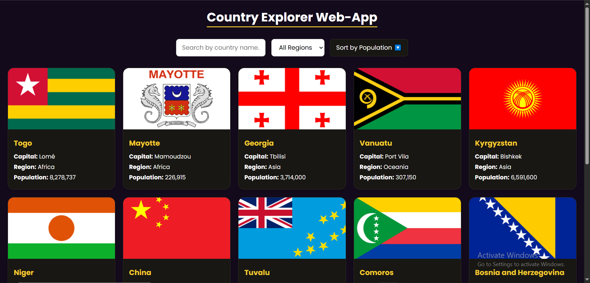
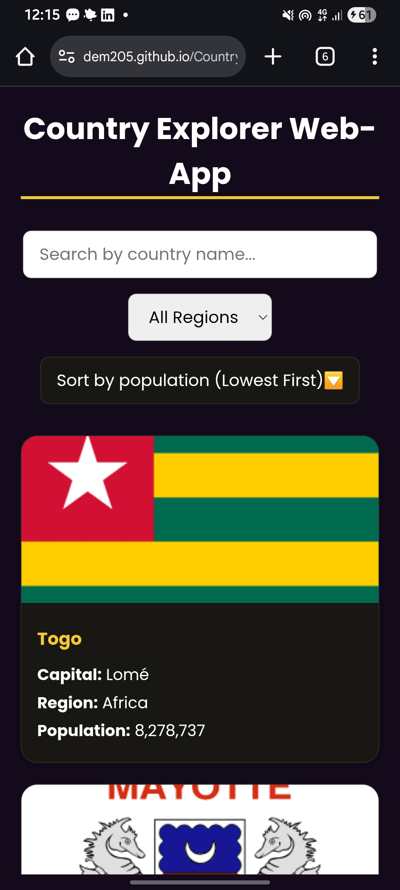

# 🌍 Country Explorer Web App

A responsive web application that fetches and displays live data about countries using the [REST Countries API](https://restcountries.com/v3.1/all?fields=name,capital,region,flags,population). Built with **HTML**, **CSS**, and **JavaScript**.

---

## ✨ Features

- ✅ Fetches country data (name, capital, region, population, flag)
- ✅ Displays countries in modern, responsive card layouts
- 🔍 Search functionality by country name (real-time)
- 🌐 Region filter (Africa, Europe, Asia, etc.)
- 🔢 Sort countries by population (ascending/descending)
- 📄 Pagination: Browse through countries page-by-page
- 📱 Fully responsive design for all screen sizes
- 💅 Clean and attractive UI using Google Fonts and custom styling

---

## 📦 Technologies Used

- HTML5
- CSS3 (Responsive Grid, Media Queries, Hover Effects)
- JavaScript (Fetch API, DOM Manipulation)
- REST Countries API v3.1

---

## 🚀 Getting Started

1. **Clone the repository:**

```bash
git clone https://github.com/dem205/country-explorer-app.git
Open the project folder:

cd country-explorer
```

Launch in your browser:
Open index.html in your preferred web browser.

🖼️ Screenshots

| Desktop View                                     | Mobile View                                    |
| ------------------------------------------------ | ---------------------------------------------- |
|  |  |


##🛠️ Folder Structure

country-explorer/
├── index.html
├── styles.css
├── script.js
├── README.md
└── /screenshots


📌 TODO (Optional Enhancements)
 Dark mode toggle ☀️🌙

 Lazy loading images or infinite scroll

 Region summary or statistics

 Country detail modal or page

📄 License
This project is open-source and available for educational use.

👨‍💻 Author
Ademilade Ogundele ❤
Frontend Web Developer | Aspiring Software Engineer
📧 ogundeleademilade@gmail.com
